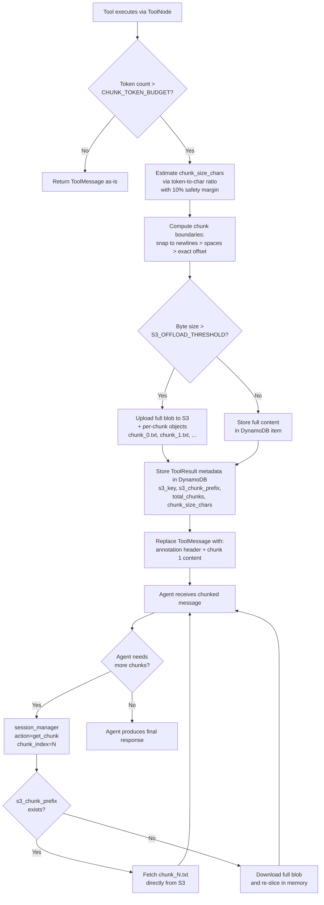

# Design Document: Multi-Tool Chat Application

## 1. Overview

This document describes the architecture, key technical decisions, trade-offs, and proposed designs for the Multi-Tool Chat Application — a full-stack system where users interact with an AI agent that can call multiple tools, upload files, persist results across sessions, and handle oversized outputs via auto-chunking.

## 2. Architecture

### 2.1 High-Level System Diagram

```
┌──────────────────┐         ┌─────────────────────────────────────────────────┐
│                  │  HTTP/  │              Backend (FastAPI)                   │
│   React SPA      │  SSE    │                                                 │
│   (Vite + TS)    │◄───────►│  /api/chat        → Context Manager → LangGraph│
│                  │         │  /api/chat/upload → S3 file upload              │
│   Hosted on      │         │  /api/sessions    → Session CRUD               │
│   App Runner     │         │                                                 │
│   (nginx)        │         │  ┌─────────────────────────────────────────┐    │
└──────────────────┘         │  │         LangGraph Agent                 │    │
                             │  │                                         │    │
                             │  │  router ─► plan (1st turn) ─► agent     │    │
                             │  │         └─► agent (subsequent)          │    │
                             │  │                                         │    │
                             │  │  ┌──────────────┐  ┌────────────────┐  │    │
                             │  │  │ Prompt Builder│  │ Tools          │  │    │
                             │  │  │ (system prompt│  │  Session Mgr   │  │    │
                             │  │  │  + tools)     │  │  DB Query      │  │    │
                             │  │  │               │  │  Web Download  │  │    │
                             │  │  └──────────────┘  │  External API  │  │    │
                             │  │                     │  File Source   │  │    │
                             │  │                     │  Data Analysis │  │    │
                             │  │  ┌──────────────┐  └───────┬────────┘  │    │
                             │  │  │ Chunking     │◄─────────┘ (large)   │    │
                             │  │  │ Middleware    │                      │    │
                             │  │  └──────┬───────┘                      │    │
                             │  │         │                              │    │
                             │  │         └──────────► agent (loop)      │    │
                             │  │                                         │    │
                             │  └─────────────────────────────────────────┘    │
                             │                                                 │
                             └──────────┬──────────────┬───────────────────────┘
                                        │              │
                            ┌───────────▼──────┐ ┌─────▼──────────┐
                            │     DynamoDB     │ │       S3       │
                            │ (single-table)   │ │ (large results │
                            │                  │ │  + uploads)    │
                            │ Sessions, Msgs,  │ │                │
                            │ Tool Results     │ │ results/{id}/  │
                            │                  │ │ uploads/       │
                            │                  │ │                │
                            └──────────────────┘ └────────────────┘
```

### 2.2 Component Responsibilities

| Component | Technology | Responsibility |
|-----------|-----------|---------------|
| Frontend | React 19, Vite 6, TypeScript, Tailwind CSS 4, TanStack Query, Radix UI / shadcn, Lucide | Chat UI, session management, file upload, SSE streaming display |
| Backend API | FastAPI, Python 3.11 | HTTP endpoints, request validation, file upload to S3, SSE streaming |
| Agent | LangGraph | Orchestration of LLM calls, tool routing, planning, auto-chunking of large results |
| Chunking Middleware | Python | Wraps the tool node; auto-stores and chunks results exceeding `CHUNK_TOKEN_BUDGET` |
| Context Manager | Python, tiktoken | Token-aware context compaction (strips old chunk data, summarizes old messages) |
| Prompt Builder | Python | Dynamic system prompt assembly with tool instructions and chunking instructions |
| Tools | LangChain @tool decorator | Session Manager, DB Query, Web Download, External API, File Source, Data Analysis |
| Storage | DynamoDB (single-table), S3 | Sessions, chat history, tool results, file uploads, large-content offloading |
| Infrastructure | Terraform | App Runner, ECR, DynamoDB, S3 |
| Build System | Pants 2.23 | Monorepo build, test, lint, Docker packaging |

### 2.3 Data Flow

1. **User sends a message** → Frontend POSTs to `/api/chat` with `session_id`, `message`, and optional `attachments` (file uploads). If the user attached a file, it was already uploaded via `POST /api/chat/upload` and the `s3://` URI is injected into the message.
2. **Backend stores the user message** in DynamoDB, then loads the full conversation history and converts it to LangChain message format.
3. **Enrichment** → The backend loads tools already used in the session from DynamoDB.
4. **LangGraph agent is invoked** with the enriched state (messages, session ID, tools used, turn count).
5. **Router** → On the first turn (`turn_count <= 1`, no assistant message yet), routes to the **Plan Node**, which generates an internal bullet-point plan as a `SystemMessage`; subsequent turns skip directly to the **Agent Node**.
6. **Agent Node** → If no system prompt exists in the messages, `build_system_prompt()` assembles one from the session ID, tool instructions, and chunking instructions. `compact_chunked_messages()` then ensures the message list fits within `MAX_CONTEXT_TOKENS` by stripping old chunk data and summarizing old messages. The LLM is invoked with bound tools.
7. **If the LLM requests a tool call**, the `tools` node (wrapped in `ChunkingMiddleware`) executes it. If the result exceeds `CHUNK_TOKEN_BUDGET` tokens, the middleware auto-stores the full result in DynamoDB (+ S3 for results >100KB) and replaces the `ToolMessage` with chunk 1 plus an annotation header. The agent can retrieve subsequent chunks via `session_manager(action='get_chunk')`.
8. **Tool-to-agent loop** → After every tool execution, the graph routes directly back to the **Agent Node** via a static edge. The agent LLM itself decides whether to make additional tool calls or produce a final response — no separate evaluation step or LLM call is needed.
9. **Streaming**: Each step emits SSE events (`token`, `tool_call`, `tool_result`, `error`, `done`). Internal `session_manager` tool calls are hidden from the user-facing message list.
10. **The final response is persisted** to DynamoDB and the session timestamp is updated.

## 3. Key Technical Decisions

### 3.1 Session Manager Tool — Context Window Management

**Problem**: Tool results can be very large (database dumps, web pages, API responses). Loading all of them into every LLM call wastes tokens and can exceed context limits.

**Solution**: The Session Manager Tool provides five operations:
- **store**: Persists the full result in DynamoDB (or S3 for results > 100KB); only returns a compact confirmation with the `result_id` and a brief summary to the LLM.
- **list**: Returns metadata (IDs, tool names, summaries, sizes) of all stored results — no full content.
- **retrieve**: Fetches the full content of a specific stored result when the agent explicitly needs it.
- **get_download_url**: Generates a presigned S3 URL for downloading a stored result, or returns the content inline if the result is stored in DynamoDB only.
- **get_chunk**: Retrieves a specific chunk of a previously auto-chunked result by `result_id` and `chunk_index` (0-based). Returns the chunk content with a header indicating chunk number and total.

This gives the agent the ability to "remember" what data is available without polluting the context window. The agent decides when to pull in specific results based on the user's current question.

Results exceeding `S3_OFFLOAD_THRESHOLD` (100KB) are automatically offloaded to S3. The full blob is stored under `results/{session_id}/{result_id}.txt` (used by `retrieve` and `get_download_url`). For auto-chunked results, each chunk is also stored as a separate object under `results/{session_id}/{result_id}/chunk_{N}.txt`, enabling O(chunk_size) retrieval instead of downloading the entire blob. The DynamoDB item stores an `s3_key` pointer to the full blob and an `s3_chunk_prefix` for direct per-chunk access.

**DynamoDB Schema** (single-table design):

| PK | SK | Use |
|----|-----|-----|
| `SESSION#{id}` | `META` | Session metadata (title, timestamps) |
| `SESSION#{id}` | `MSG#{iso_ts}#{msg_id}` | Chat messages (sorted by time) |
| `SESSION#{id}` | `RESULT#{result_id}` | Tool results (metadata + full content or `s3_key` pointer + optional `s3_chunk_prefix` for per-chunk access) |

### 3.2 Context Window Management

**Problem**: Conversations grow unbounded; earlier messages waste tokens and can exceed context limits. Without management, long sessions eventually fail or produce degraded responses.

**Solution**: The Context Manager (`services/context_manager.py`) applies a two-pass compaction strategy via `compact_chunked_messages()` before each LLM invocation.

- **Token counting**: Uses `tiktoken` for accurate counts on OpenAI models; falls back to a `len(content) / 4` heuristic for non-OpenAI providers.
- **Pass 1 — strip chunk data**: For messages outside the most recent `RECENT_TURNS_TO_PRESERVE` (default 5), chunked `ToolMessage`s have their raw data stripped, keeping only the annotation header (e.g., `[Chunked: result_id=..., chunk 1/N, ...]`). This preserves the `tool_call_id` pairing required by OpenAI while dramatically reducing tokens.
- **Pass 2 — summarize old messages**: If still over budget, older messages are replaced with compact placeholders. `ToolMessage`s become `[Summarized tool result]` with preserved `result_id` references. `AIMessage`s with tool calls keep only the `tool_calls` metadata. Human messages are preserved as-is.
- **Re-retrieval**: The prompt instructs the agent to use `session_manager(action='get_chunk')` or `data_analysis` to re-fetch data from compacted results when needed.

Configured via `MAX_CONTEXT_TOKENS` (default 25,000) and `RECENT_TURNS_TO_PRESERVE` (default 5).

### 3.3 Dynamic Prompt Builder

The system prompt is assembled dynamically by `build_system_prompt()` in `agent/prompt_builder.py`. It composes the following sections:

1. **Base identity**: "You are a helpful multi-tool AI assistant."
2. **Session ID**: Included so the agent can pass it to `session_manager` calls.
3. **Tool instructions**: Full descriptions for tools already used in the session; concise one-liners for the rest. Includes `data_analysis` as the preferred tool for analytical follow-up queries on large files.
4. **Chunking instructions**: Explains the auto-chunking annotation format (`[Chunked: result_id=..., chunk 1/N, ...]`), how to retrieve subsequent chunks via `session_manager(action='get_chunk')`, and when to use `data_analysis` for server-side computation instead of re-reading full files.

### 3.4 Planning Node and Tool Loop

**Plan Node** (`plan_node`):
- Activated on the first turn of a conversation (`turn_count <= 1` and no prior assistant message).
- The router directs to `plan` before `agent`. The plan node generates a short internal bullet-point plan as a `SystemMessage` (e.g., "Internal plan: 1. Query the database... 2. Summarize results...").
- On subsequent turns, the router skips directly to `agent`.

**Direct tools-to-agent edge** (no evaluation node):
- After every tool execution, a static graph edge routes directly back to the `agent` node. The agent LLM itself decides whether it has enough information to respond or needs additional tool calls.
- This avoids a separate evaluation LLM call per loop iteration, which halves API usage and avoids Tier 1 rate limit issues. The conditional routing at `agent` (`_route_after_agent`) checks whether the last message contains `tool_calls`; if so it goes to `tools`, otherwise it ends the graph.

### 3.5 Chunking Middleware

**Problem**: Large tool results (database dumps, CSV files, web pages) can exceed the context window in a single message, or waste tokens when the agent only needs a portion of the data.

**Solution**: `ChunkingMiddleware` (`services/chunking.py`) wraps the LangGraph `ToolNode`. After tool execution, any `ToolMessage` whose content exceeds `CHUNK_TOKEN_BUDGET` tokens is:

1. **Persisted in full** to DynamoDB (+ S3 if the raw content exceeds 100KB). When offloaded to S3, each chunk is also uploaded as a separate object (`results/{session_id}/{result_id}/chunk_{N}.txt`) alongside the full blob, enabling efficient per-chunk retrieval without downloading the entire result.
2. **Split** into chunks of approximately `CHUNK_TOKEN_BUDGET` tokens each (with a 10% safety margin to account for non-uniform token density). Chunk boundaries are snapped to newlines when possible, then to word boundaries (spaces) as a fallback; content with neither (e.g. base64 or minified JSON) is split at exact character offsets.
3. **Replaced** in the message stream with chunk 1 plus a metadata annotation: `[Chunked: result_id=<id>, chunk 1/N, ...]`.

The agent retrieves subsequent chunks on demand via `session_manager(action='get_chunk', result_id=<id>, chunk_index=N)`. When per-chunk S3 objects are available (`s3_chunk_prefix` is set on the `ToolResult`), retrieval fetches only the requested chunk object directly from S3 instead of downloading and re-slicing the full blob. A backward-compatible fallback handles older results that lack per-chunk storage.

The entire persistence path (S3 upload + DynamoDB store) is wrapped in error handling: on failure, any partially uploaded S3 objects are cleaned up and the original unmodified `ToolMessage` is returned to the agent so the conversation continues gracefully.

Configured via `CHUNK_TOKEN_BUDGET` (default 10,000).

**Chunking Pipeline:**



The diagram above shows the full lifecycle: the `ChunkingMiddleware` intercepts large `ToolMessage`s after tool execution, persists them, and replaces the message with chunk 1. On subsequent turns, the agent retrieves additional chunks on demand via `session_manager(action='get_chunk')`, with per-chunk S3 objects enabling O(chunk_size) retrieval.

### 3.6 Data Analysis Tool

**Problem**: After the agent reads a large CSV or JSON file (via `file_source`), follow-up analytical queries (sums, averages, filtering) would require re-reading the entire file into the context window.

**Solution**: The `data_analysis` tool (`tools/data_analysis.py`) runs computations server-side using pandas and returns only the result. Supported operations: `describe`, `head`, `tail`, `aggregate` (sum/mean/count/min/max/std/median/nunique with optional group_by), `query` (pandas DataFrame query expressions), `value_counts`, and `search`. The prompt builder instructs the agent to prefer `data_analysis` over `file_source` for analytical follow-ups.

### 3.7 File Upload

Users can attach CSV or PDF files via the frontend (paperclip button in the message input). The upload flow:

1. Frontend sends the file via `POST /api/chat/upload` as multipart form data.
2. Backend validates the file type (`.csv` or `.pdf`) and size (max 50 MB), then uploads to S3 under `uploads/{session_id}/{file_id}_{filename}`.
3. The response includes an `s3://` URI. The frontend attaches this as a `FileAttachment` on the chat request.
4. The backend injects the attachment metadata into the user's `HumanMessage`, instructing the agent to use `file_source` or `data_analysis` with the S3 URI.

**Graph Flow:**

```
router ─► [first turn] ─► plan ─► agent
       └► [subsequent] ────────► agent

agent ─► [tool calls] ─► tools (ChunkingMiddleware) ─► agent
       └► [no tool calls] ─► END
```

### 3.8 Pluggable LLM Provider

The LLM is created by a factory function (`agent/llm_factory.py`) that reads the `LLM_PROVIDER` environment variable and returns the appropriate LangChain chat model. Three providers are supported:


| Provider | Package | Default Model |
|----------|---------|---------------|
| `openai` | `langchain-openai` | `gpt-4o` (`OPENAI_MODEL`) |
| `anthropic` | `langchain-anthropic` | `claude-sonnet-4-20250514` (`ANTHROPIC_MODEL`) |
| `bedrock` | `langchain-aws` | Uses `OPENAI_MODEL` + `AWS_REGION` |

All providers are configured with `streaming=True` and the factory is cached with `@lru_cache`. This means:
- Local development can use OpenAI or Anthropic.
- Production on AWS can use Bedrock without code changes.
- The provider can be swapped by changing a single env var.

### 3.9 SSE Streaming over WebSockets

SSE was chosen over WebSockets because:
- The communication is unidirectional (server → client for streaming).
- SSE is simpler to implement (no connection upgrade, works through most proxies/CDNs).
- User messages are sent via standard HTTP POST — no need for a persistent bidirectional channel.
- If collaborative features were needed (e.g., multiple users in one session), WebSockets would be the right choice.

### 3.10 LangGraph over Plain LangChain Chains

LangGraph provides:
- Explicit graph-based control flow (agent → tools → agent loop).
- Native support for conditional edges (the routing logic).
- Clean separation of concerns: each node is independently testable.
- Stream mode `updates` allows us to emit SSE events as each node completes.

### 3.11 Pants Build System

Pants provides a unified build for the monorepo:
- **Python backend**: `python_sources`, `python_tests`, `python_requirements` targets. Tests run via `pants test backend/tests::`.
- **Frontend**: Wrapped in `shell_command` (Pants' native Node.js support is experimental). `npm ci && npm run build` is a reliable approach.
- **Docker**: `docker_image` targets for both frontend and backend.
- **Lint**: Black, isort, and mypy integrated via Pants backends.

### 3.12 Single-Table DynamoDB Design

A single DynamoDB table stores sessions, messages, and tool results using composite keys. Benefits:
- One table to provision, monitor, and back up.
- All data for a session is co-located (efficient `Query` operations).
- PAY_PER_REQUEST billing for simplicity.

The trade-off is that cross-session queries (e.g., "find all sessions") require a `Scan`, which is acceptable at the expected scale.

## 4. Trade-offs

| Decision | Benefit | Cost |
|----------|---------|------|
| SSE instead of WebSocket | Simpler implementation, good proxy compatibility | No bidirectional streaming |
| DynamoDB single-table | Co-located data, simple provisioning | Scan needed for cross-partition queries |
| SQLite for local DB tool | Zero setup for development | Not representative of production (RDS) |
| Pants shell_command for frontend | Reliable, no experimental dependencies | Less integrated than native Pants Node support |
| No authentication | Faster development | Not production-ready without auth layer |
| App Runner instead of ECS Fargate | Simpler provisioning, built-in TLS/auto-scaling, no VPC/ALB management | Less control over networking, fewer customization options |
| API key in Secrets Manager | Secure secret injection into App Runner at runtime | Requires `secretsmanager:GetSecretValue` IAM permission |
| S3 offloading for large results | Bypasses DynamoDB 400KB item limit, enables presigned download URLs | Additional service dependency, eventual consistency for reads |
| tiktoken for token counting | Accurate token counts for OpenAI models | Falls back to `len/4` heuristic for non-OpenAI providers |
| Chunking over LLM summarization | Preserves full data fidelity; agent retrieves exact chunks on demand | Requires multiple round-trips for large results; more tool calls |
| Per-chunk S3 storage | O(chunk_size) retrieval per `get_chunk` call instead of O(total_size); no re-computation of chunk boundaries on read | Doubles S3 storage for chunked results (full blob + individual chunk objects) |
| Context compaction (strip + summarize) | Keeps context within budget while preserving result_id references | Old messages lose detail; agent must re-fetch data via `get_chunk` |
| First-turn planning node | Better tool usage on complex first questions | Adds latency to the first response in a session |
| Direct tools-to-agent edge (no evaluate node) | Halves API calls per tool loop; avoids rate-limit issues; simpler graph | Agent may loop unnecessarily if it misinterprets tool results |
| Server-side data_analysis tool | Avoids loading full files into context window; accurate pandas computations | Limited to pandas operations; requires server-side file access |
| File upload via S3 | Users can attach CSV/PDF files for agent processing | Requires S3 bucket configuration; 50 MB file size limit |

## 5. Feature Status

| Feature | Status | Notes |
|---------|--------|-------|
| Session Manager tool (store/retrieve/list/download/get_chunk) | Implemented | Full CRUD + chunk retrieval with S3 offloading for large results |
| Auto-chunking of large tool results | Implemented | `ChunkingMiddleware` wraps tool node; persists full result + per-chunk S3 objects, sends chunk 1 to agent; graceful fallback on persistence failure |
| Context window management (compaction) | Implemented | `compact_chunked_messages()` with tiktoken counting; strips old chunk data, summarizes old messages |
| Dynamic prompt builder | Implemented | Assembles system prompt from tool instructions and chunking instructions |
| Planning node (first-turn strategy) | Implemented | Internal bullet-point plan on first turn before agent acts |
| Tool loop (direct edge back to agent) | Implemented | Static edge from tools to agent; agent LLM decides when to stop |
| Data analysis tool | Implemented | Server-side pandas analysis (describe, aggregate, query, filter, search, value_counts) |
| File upload (CSV/PDF) | Implemented | Frontend paperclip button; backend uploads to S3; agent processes via file_source or data_analysis |
| Database query tool | Implemented | Read-only SQL against SQLite (demo) |
| Web download tool | Implemented | Fetch + strip HTML |
| External API tool | Implemented | GET/POST to arbitrary endpoints |
| File source tool | Implemented | Reads CSV, JSON, and PDF from local or S3 |
| Pluggable LLM provider | Implemented | OpenAI, Anthropic, Bedrock via factory |

## 6. Assumptions

1. The application is single-tenant for the PoC (no multi-user auth).
2. DynamoDB items are limited to 400KB — tool results larger than this are automatically offloaded to S3 when the S3 bucket is configured (see `S3_OFFLOAD_THRESHOLD`).
3. The SQLite database tool is for demonstration; production would use RDS via SQLAlchemy.
4. LLM API keys are stored in AWS Secrets Manager for production (App Runner injects them at runtime). Locally, they are read from the `.env` file. No fallback if the LLM is unreachable.
5. The sample database and CSV files are included for demonstration purposes.
